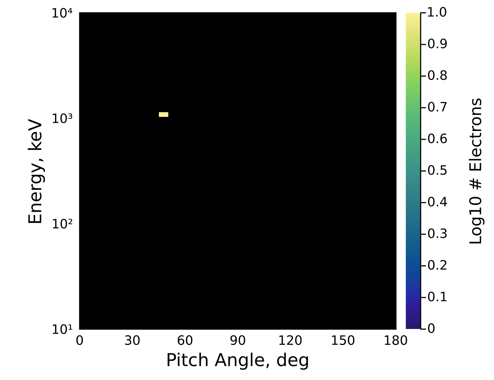
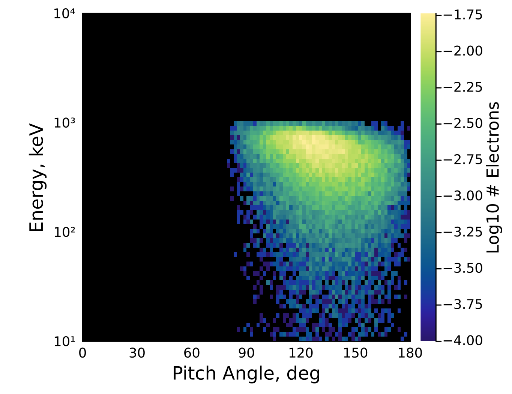
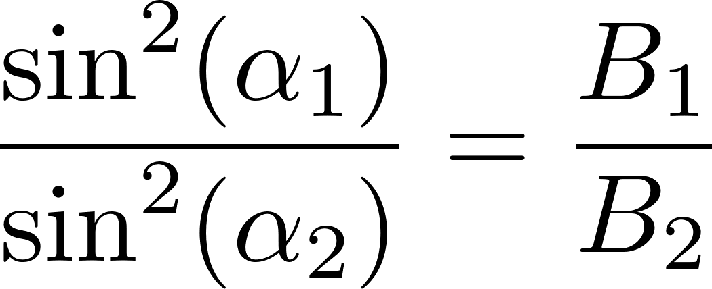

# EPPBackscatterSimulation
A Julia port of the [G4EPP Python library](https://github.com/GrantBerland/G4EPP/tree/main?tab=readme-ov-file) developed by Grant Berland, with new wrapper functions for ease of use. Currently only contains functions for simulating electron backscatter.

## Importing

To use this library, download the .zip and unpack it. This should give you a folder named `EPPBackscatterSimulation`. Move this folder to a location of your convenience. Add this line to any Julia script to access the functions:

```
include("<path to EPPBackscatterSimulation folder>/BackscatterSimulation.jl")
```

## Example Usage
### Simulating Backscatter

Create an input distribution: \
This library simulates backscatter on an energy-pitch angle grid, represented in code by a 2D array. The first dimension represents energy, and the second dimension represents pitch angle. The number of bins in each dimension defaults to 70 and 100, respectively.

This library supports input energies from 10 keV to 10 MeV, and input pitch angles from 0º to 70º. Any inputs outside this range will return all zeros.

So to create a distribution to simulate, let's first access the energy and pitch angle bins. **Energies are in keV and pitch angles in degrees.**

```
include("./EPPBackscatterSimulation/BackscatterSimulation.jl")

energy_nbins, energy_bin_edges, energy_bin_means, pa_nbins, pa_bin_edges, pa_bin_means, SIMULATION_α_MAX = get_data_bins()
```

Then, we can create a distribution to input. For this example, let's create a beam from 1 to 1.1 MeV with pitch angles 45 to 50 degrees.

```
# Create empty distribution
input_distribution = zeros(energy_nbins, pa_nbins)

# Find region where our beam is
energy_indices = 1000 .≤ energy_bin_means .≤ 1100
pitch_angle_indices = 45 .≤ pa_bin_means .≤ 50

# Create beam
input_distribution[energy_indices, pitch_angle_indices] .= 10
```

We can preview the distribution to make sure it's correct with `plot_distribution()`.

```
plot_distribution(input_distribution)
```


Now we can simulate the backscatter.
```
output_distributions = backscatter_simulation(input_distribution, n_bounces = 1)
```
This returns an `n_bounces`x`energy_nbins`x`pa_nbins` array. The first array (`distributions[1,:,:]`) is our input distribution. The second array (`distributions[2,:,:]`) is the backscatter after the first bounce. You can simulate multiple bounces between hemispheres with the `n_bounces` keyword.

We can now look at the backscatter distribution:
```
plot_distribution(output_distributions[2,:,:])
```


The units of all distributions are in number of electrons.

### Using a Different Grid
To re-bin the backscatter data to a new grid, run the function `bin_backscatter_data(energy_nbins, pa_nbins)` with your desired number of bins for each dimension. Any simulation run after this will be on the new grid.

## Technical Notes
• Beams are inputted to the simulation at an alitude of 300km. The output distributions are recorded at 450 km. Conversions to and from pitch angle distributions at other locations can be performed with the following relation: \


• You may see 'banding' in the backscatter for some input PADs. This banding is non-physical. It is due to the fact that the backscatter simulation is performed using a weighted sum of the backscatter of several discrete monoenergetic beams, causing a banding effect when the backscatter from each individual beam is noticeable. 

---

Developed in Julia 1.9.2

Julia Claxton (she/her) \
Contact: julia.claxton@colorado.edu \
Lightning, Atmosphere, Ionosphere, and Radiation Belts (LAIR) Group, University of Colorado Boulder